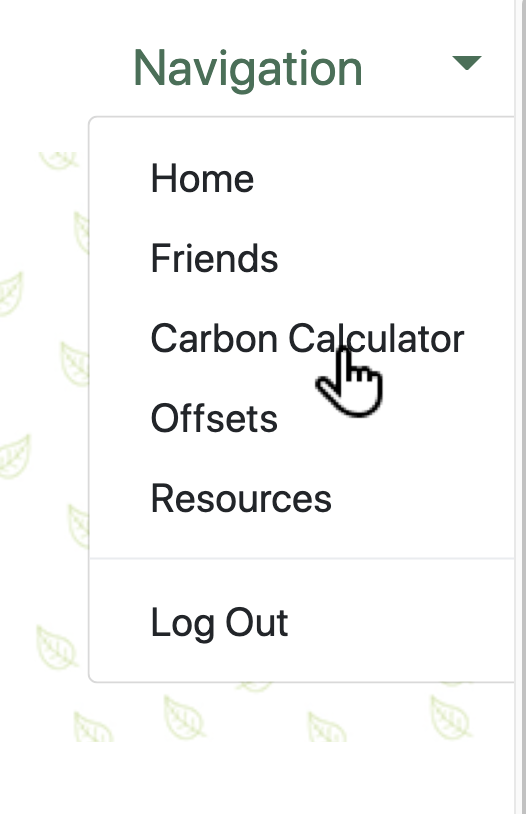
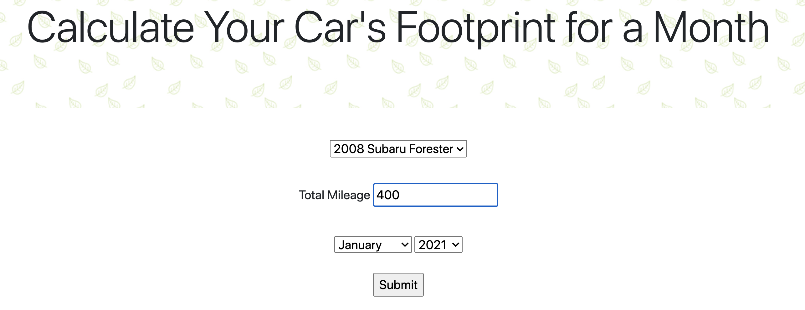
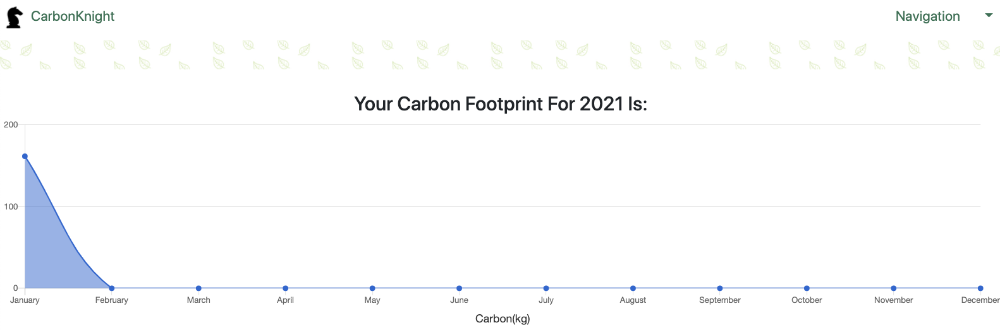
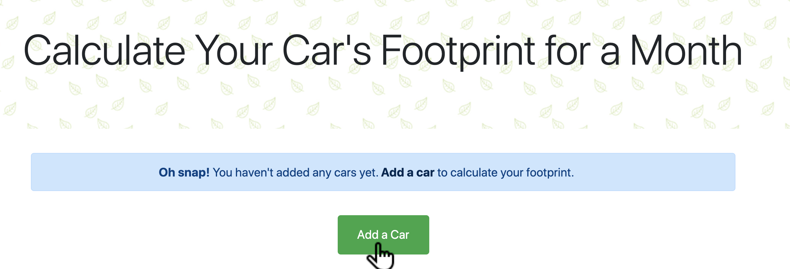
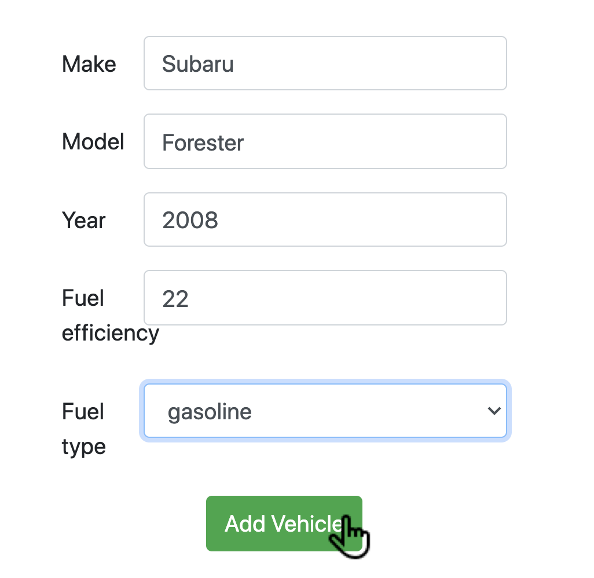
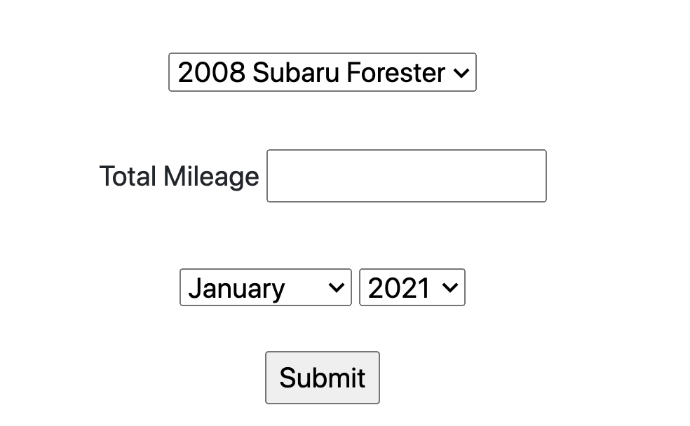

# Carbon Knight

<!-- PROJECT SHIELDS -->
[![Contributors][contributors-shield]][contributors-url]
[![Forks][forks-shield]][forks-url]
[![Stargazers][stars-shield]][stars-url]
[![Issues][issues-shield]][issues-url]
[](https://travis-ci.com/github/Carbon-Knight/Front-End)


<h2 align="center">
  <a href="https://carbon-knight.herokuapp.com/">Try It Out!</a>
</h2>

  <p align="center">
    This is the front end repository for the Carbon Knight application. Within this application a user is able to input their travel data and see what their unique carbon footprint is over time.
    <br />
    <br />
    <!-- for adding a demo video
    <a href="Add our video link here">View Demo</a>  · -->
    ·
    <a href="https://github.com/Carbon-Knight/carbon-knight-back-end/issues">Report Bug</a>
    ·
    <a href="https://github.com/Carbon-Knight/carbon-knight-back-end/issues">Request Feature</a>
  </p>


<!-- TABLE OF CONTENTS -->
## Table of Contents

* [About the Project](#about-the-project)
  * [Built With](#built-with)
* [Features](#features)
  * [Navigation](#navigation)
  * [Welcome](#welcome)
  * [Login and Logout](#login-and-logout)
  * [User Dashboard](#user-dashboard)
  * [Calculating Carbon Footprint](#calculating-carbon-footprint)
  * [Adding a New User Car](#adding-a-new-user-car)
  * [Resources](#resources)
* [Getting Started](#getting-started)
  * [Prerequisites](#prerequisites)
  * [Configuration](#configuration)
  * [Testing](#testing)
* [Contributing](#contributing)
* [Contact](#contact)
* [Acknowledgements](#acknowledgements)


<!-- ABOUT THE PROJECT -->
## About The Project

There are three repositories for this project. The Front End, which we will discuss further throughout this document, a Microservice which connects with the [Cloverly API](https://www.cloverly.com/) in order to return carbon footprint data, and the Back End, which compiles this data and returns the requested data to the Front End.

To view all the repositories associated with Carbon Knight, please visit [Carbon Knight](https://github.com/Carbon-Knight)


### Built With

* [Ruby](https://github.com/ruby/ruby)
* [GraphQL](https://graphql.org/)
* [Sinatra](http://sinatrarb.com/)
* [TravisCI](https://www.travis-ci.com/)
* [Heroku](https://www.heroku.com/)


## ***Features:***

### Navigation

The navigation bar at the top of the page presents links to reach other pages of the site.  The user will see different links within the navigation bar depending on if they have logged in or not.

### Welcome

This is the main landing page for a visitor.  Here a visitor is able to see a brief description of the application and are then required to log in to see more of the site.

### Login and Logout

[Google OAuth 2](https://developers.google.com/identity) was used in order for a user to log in to this site.  On the welcome page a user is able to 'Log in with Google' where they are then redirected to authenticate through their google account.

### User Dashboard

After logging in a user is taked to their dashboard.  Here they are able to see a graphical representation of all their carbon footprints.  There is also links to take them to input a new footprint or edit old footprints. <br />

### Calculating Carbon Footprint

1. Click on 'Carbon Calculator' in the navigation drop down
<details>  

</details><br />

1. Select your saved car from the drop down, enter the total monthly mileage you drove in your car, and select the month and year for the calculation. Click 'Submit'
<details>

</details><br />

1. You will be redirected to your user dashboard with an update visual of your carbon footprint estimate in kilograms of carbon.  
<details>

</details><br />

### Adding a New User Car
1. Click on 'Carbon Calculator' in the navigation drop down
<details>   

</details><br />

1. Click 'Add a Car' button to navigate to the new car form
<details>  

</details><br />

1. Complete the required fields for a new car (Make, Model, Year, Fuel efficiency, Fuel type)<br />

1. Click 'Add Vehicle' once all fields have been completed (an error message will display otherwise)
<details>   

</details><br />

1. You will be redirected to the carbon calculator page and the added car will be visible within the car selection drop down
<details>   

</details><br />

### Resources

The resources page offers the user more information about carbon footprints and what can be done to reduce them.  These are links to extermal pages that offer information and resources to a curious user.  This page is accessible to a regular visitor as well as a logged in user.

<!-- GETTING STARTED -->
## Getting Started
To properly use this application you will need to set up and configure three repositories. Follow the *Configuration* directions in each repository to get Carbon Knight running locally! Alternatively, check out the production application [here](https://carbon-knight.herokuapp.com/)!!!

To view all the repositories associated with Carbon Knight, please visit [Carbon Knight](https://github.com/Carbon-Knight)

###### **The Front End**
To view the configuration settings for the Front End, see below or click [here](https://github.com/Carbon-Knight/Front-End#configuration).

###### **The Back End**
To view the configuration settings for the Back End, click [here](https://github.com/Carbon-Knight/carbon-knight-back-end#configuration).

######  **The Cloverly Microservice**
To view the configuration settings for the Cloverly Microservice, click [here](https://github.com/Carbon-Knight/cloverly_microservice/blob/main/README.md#configuration).


### Configuration
**Setting Up the Front-End**
1. Clone this repo `git clone https://github.com/Carbon-Knight/Front-End.git`

2. Enter the directory it was cloned into `cd Front-End`

3. Run `bundle install` to install gems and dependencies

4. Run `bundle exec rails db:{create,migrate}` to set up the database

5. Run `bundle exec figaro install`
  * Add `GOOGLE_CLIENT_ID: <ID HERE>` to the `config/application.yml` file created
    by figaro
  * Add `GOOGLE_CLIENT_SECRET: <SECRET HERE>` to the above file

### Configuration Part II
Once you have all the repositories cloned and set up according to their specific instructions, you can test out the full application by doing the following;

1. In your terminal within the Front End directory run ```rails s```.

2. In a new tab in your terminal, within the Back End directory run ```rails s -p 3001```.

3. In a new tab in your terminal, within the Cloverly Microservice directory run ```ruby lib/cloverly_microservice.rb```.

4. Visit ```http://localhost:3000/```

5. Sign in and you are ready to Rock'n'Roll :tada: !

### Testing

[RSpec](https://rspec.info/) was used for the testing of this project.

Carbon Knight has been fully tested. To view the test coverage;

Once inside your terminal within the desired directory run the following command.

```
open coverage
```

This will open up a folder with an **index.html** file. Clicking on this file will show you a list of all the lines of code within this project, and whether they have been tested or not.

Additionally, running ```bundle exec rspec``` will show you the quick summary of the test coverage in this application.

Both ```open coverage``` and ```bundle exec rspec``` work inside each repository of this application.

<!-- ROADMAP -->
## Roadmap

See our [Open Issues](https://github.com/Carbon-Knight/carbon-knight-back-end/issues)  or visit our [Project Board](https://github.com/orgs/Carbon-Knight/projects/1) for a list of proposed features, known issues, and project extensions.


<!-- CONTRIBUTING -->
## Contributing

Contributions are what make this community such an amazing and fun place to learn, grow, and create! Any contributions you make are **greatly appreciated**.

1. Fork the Project
2. Create your Feature Branch ```git checkout -b feature/NewGreatFeature```
3. Commit your Changes ```git commit -m 'Add some NewGreatFeature'```
4. Push to the Branch ```git push origin feature/NewGreatFeature```
5. Open a new Pull Request!


<!-- CONTACT -->
## Contact

Curtis Bartell &nbsp;&nbsp;&nbsp;&nbsp;&nbsp;&nbsp; - [![LinkedIn][linkedin-shield]](https://www.linkedin.com/in/curtis-bartell/) - [GitHub](https://github.com/c-bartell)

Jonathan Wilson - [![LinkedIn][linkedin-shield]](https://www.linkedin.com/in/jonathan--wilson/) - [GitHub](https://github.com/Jonathan-M-Wilson)

Carson Jardine &nbsp;&nbsp; - [![LinkedIn][linkedin-shield]](https://www.linkedin.com/in/carson-jardine/) - [GitHub](https://github.com/carson-jardine)

Eugene Theriault - [![LinkedIn][linkedin-shield]](https://www.linkedin.com/in/eugene-theriault/) - [GitHub](https://github.com/ETBassist)

Roberto Basulto &nbsp;- [![LinkedIn][linkedin-shield]](https://www.linkedin.com/in/roberto-basulto/) - [GitHub](https://github.com/Eternal-Flame085)

James Belta &nbsp;&nbsp;&nbsp;&nbsp;&nbsp;&nbsp;&nbsp; - [![LinkedIn][linkedin-shield]](https://www.linkedin.com/in/james-belta/) - [GitHub](https://github.com/JBelta)

Joshua Carey &nbsp;&nbsp;&nbsp;&nbsp;&nbsp;- [![LinkedIn][linkedin-shield]](https://www.linkedin.com/in/carey-joshua/) - [GitHub](https://github.com/jdcarey128)

Kiera Allen &nbsp;&nbsp;&nbsp;&nbsp;&nbsp;&nbsp;&nbsp;&nbsp;&nbsp;&nbsp;- [![LinkedIn][linkedin-shield]](https://www.linkedin.com/in/kieraallen/) - [GitHub](https://github.com/KieraAllen)

Sean Steel &nbsp;&nbsp;&nbsp;&nbsp;&nbsp;&nbsp;&nbsp;&nbsp;&nbsp;&nbsp;- [![LinkedIn][linkedin-shield]](https://www.linkedin.com/in/sean-steel/) - [GitHub](https://github.com/s-steel)


Project Link: [Carbon Knight](https://github.com/Carbon-Knight)


<!-- ACKNOWLEDGEMENTS -->
<!-- Add resources that were used to help create this project here -->


<!-- MARKDOWN LINKS & IMAGES -->
[contributors-shield]: https://img.shields.io/github/contributors/Carbon-Knight/carbon-knight-back-end
[contributors-url]: https://github.com/Carbon-Knight/carbon-knight-back-end/graphs/contributors
[forks-shield]: https://img.shields.io/github/forks/Carbon-Knight/carbon-knight-back-end
[forks-url]: https://github.com/Carbon-Knight/carbon-knight-back-end/network/members
[stars-shield]: https://img.shields.io/github/stars/Carbon-Knight/carbon-knight-back-end
[stars-url]: https://github.com/Carbon-Knight/carbon-knight-back-end/stargazers
[issues-shield]: https://img.shields.io/github/issues/Carbon-Knight/carbon-knight-back-end
[issues-url]: https://github.com/Carbon-Knight/carbon-knight-back-end/issues
[linkedin-shield]: https://img.shields.io/badge/-LinkedIn-black.svg?style=flat-square&logo=linkedin&colorB=555
